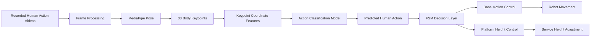
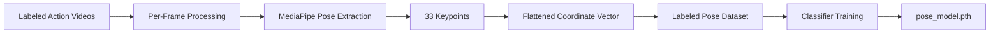
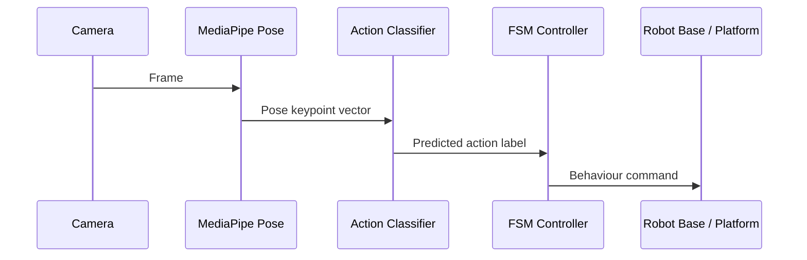
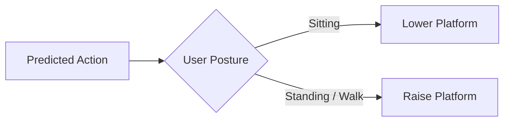
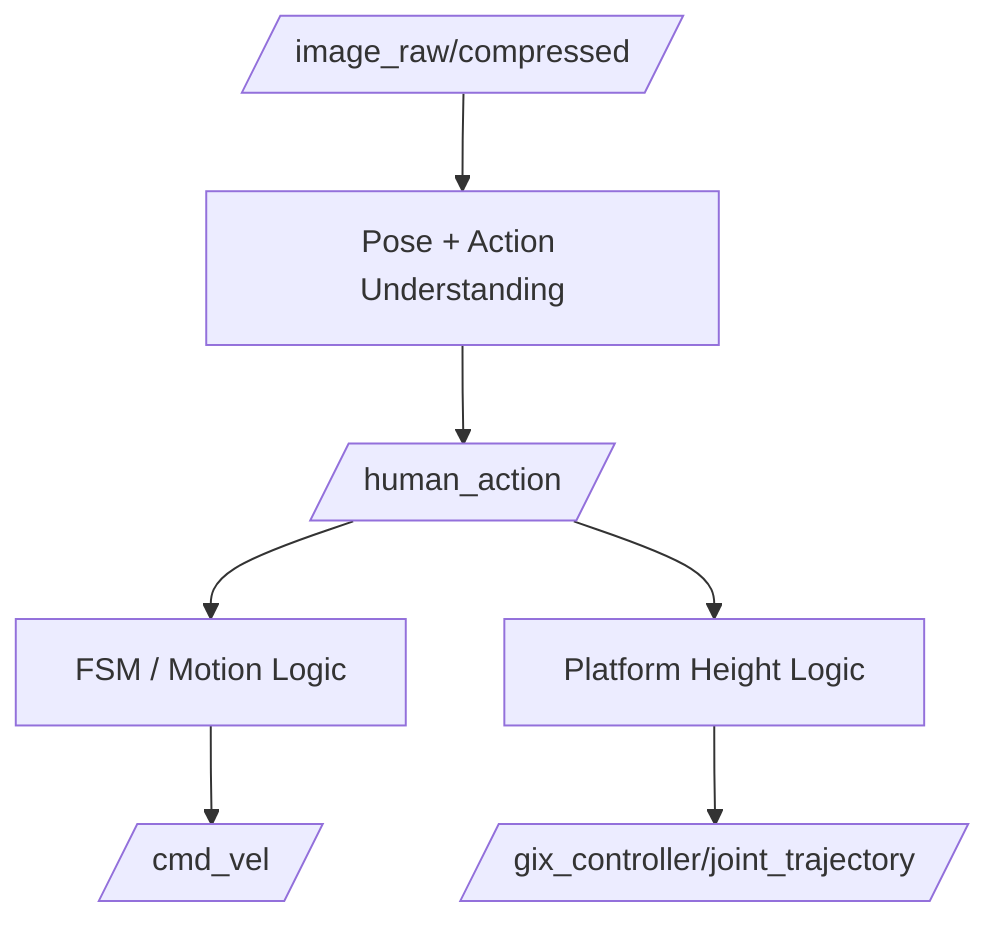

# TurtleBot3 Human-Following Robot

> **YOLO · MediaPipe · Finite State Machine · ROS 2**


https://github.com/user-attachments/assets/6a32c3fb-03b1-4017-95bf-57bd3f3b3c3a


  


> **TurtleBot3 + ROS 2 Humble + MediaPipe Pose + Keypoint-Based Action Model + FSM-Controlled Service Behaviour**

BuddyBot is a service-oriented human-robot interaction system built on **TurtleBot3** and **ROS 2 Humble**. The project explores a practical question in service robotics:

> How can a mobile robot understand a user's body action from a camera stream and convert that understanding into appropriate service behaviour?

The answer in this project is a full perception-to-action pipeline:

1. record representative user actions,
2. extract body pose keypoints with **MediaPipe Pose**,
3. convert keypoints into structured numerical features,
4. train an action classification model on those features,
5. use the predicted action as semantic input to a **Finite State Machine (FSM)**,
6. drive the robot base and height-adjustable platform to provide context-aware service.

Rather than classifying raw RGB frames directly, BuddyBot uses **pose keypoints as an intermediate representation**. This makes the system lighter, more explainable, and easier to train with limited task-specific data.

Supplementary Chinese walkthrough and interview notes are collected under `docs/notes/`.

---

## Table of Contents

- [1. Project Story](#1-project-story)
- [2. What Problem the Robot Solves](#2-what-problem-the-robot-solves)
- [3. System-at-a-Glance](#3-system-at-a-glance)
- [4. End-to-End Architecture](#4-end-to-end-architecture)
- [5. Why Keypoint-Based Learning](#5-why-keypoint-based-learning)
- [6. Training Data Pipeline](#6-training-data-pipeline)
- [7. Pose Feature Representation](#7-pose-feature-representation)
- [8. Action Classification Model](#8-action-classification-model)
- [9. Runtime Inference Pipeline](#9-runtime-inference-pipeline)
- [10. Decision Layer: Finite State Machine](#10-decision-layer-finite-state-machine)
- [11. Motion and Service Execution](#11-motion-and-service-execution)
- [12. Height Adaptation Strategy](#12-height-adaptation-strategy)
- [13. Safety and Robustness](#13-safety-and-robustness)
- [14. ROS 2 Communication View](#14-ros-2-communication-view)
- [15. Typical Interaction Scenario](#15-typical-interaction-scenario)
- [16. Repository Assets](#16-repository-assets)
- [17. Installation](#17-installation)
- [18. Running the Project](#18-running-the-project)
- [19. Design Tradeoffs](#19-design-tradeoffs)
- [20. Limitations and Future Work](#20-limitations-and-future-work)

---

## 1. Project Story

BuddyBot is not just a person-following robot. It is designed as a **service interaction robot** that should react differently depending on what the user is doing.

In a real service setting, a robot should not always keep the same behaviour:

- if the user waves, the robot should start or stop service,
- if the user is walking, the robot should follow,
- if the user sits down, the robot should move closer and lower its service platform,
- if the user reaches out, the robot should interpret that as a request for closer interaction,
- if the user stands up again, the robot should restore a more comfortable distance.

This project therefore combines:

- **visual perception** to understand the user,
- **action classification** to interpret intent,
- **state-based control** to make behaviour stable,
- **mobile and height control** to physically deliver service.

---

## 2. What Problem the Robot Solves

The project targets a common gap in simple mobile robots: many robots can detect a person, but they do not understand **interaction context**.

BuddyBot addresses that gap by linking body action to service behaviour. The goal is to let the robot answer questions such as:

- Is the user asking to start service?
- Is the user standing or sitting?
- Does the user want the robot to come closer?
- Should the interaction happen at a normal or lowered platform height?

The project therefore focuses on **intent-aware service behaviour**, not only tracking or navigation.

---

## 3. System-at-a-Glance

BuddyBot can be understood as four connected layers:

1. **Data Layer**  
   Action videos are recorded and labelled.

2. **Perception Layer**  
   MediaPipe Pose extracts 33 body landmarks and converts them into pose features.

3. **Understanding Layer**  
   A trained model predicts the user's current action.

4. **Behaviour Layer**  
   An FSM translates action labels into robot states such as follow, approach, retreat, and platform-height adjustment.

---

## 4. End-to-End Architecture

### 4.1 Full Project Pipeline



### 4.2 Runtime Logic View

```mermaid
flowchart TD
    CAM[Camera Stream] --> POSE[MediaPipe Pose Estimation]
    POSE --> FEAT[Pose Feature Vector]
    FEAT --> CLS[Trained Action Classifier]
    CLS --> ACT[/human_action]
    ACT --> FSM[FSM Behaviour Controller]
    FSM --> CMD[/cmd_vel]
    ACT --> PLATFORM[Height Controller]
    PLATFORM --> TRAJ[/gix_controller/joint_trajectory]
```

### 4.3 Story in One Line

```text
human video
  -> MediaPipe pose estimation
  -> body keypoints
  -> numerical pose features
  -> trained classifier
  -> action label
  -> FSM
  -> robot service behaviour
```

---

## 5. Why Keypoint-Based Learning

This project intentionally avoids training directly on raw RGB images.

Raw images contain a large amount of irrelevant variation:

- clothing color,
- background clutter,
- lighting changes,
- camera noise,
- scene appearance differences.

For this project, the most important information is the **structure of the human body**, not the texture of the image. That is why BuddyBot first converts video into pose landmarks and only then performs action classification.

This gives several advantages:

- lower-dimensional input,
- faster model training,
- better interpretability,
- better focus on motion and posture,
- easier deployment on a lightweight robot system.

In short, MediaPipe acts as a **pose front-end**, while the trained classifier acts as the **action understanding back-end**.

---

## 6. Training Data Pipeline

The training process starts with collecting representative action samples for service interaction.

### 6.1 Action Recording

Videos are recorded for the main interaction actions used by the robot, such as:

- `Wave`
- `Reach Out`
- `Sitting`
- `Standing`
- `Walk`

These recordings provide the raw behavioural data from which the robot learns.

### 6.2 Frame-to-Pose Conversion

Each recorded video is processed frame by frame. Every frame is sent into **MediaPipe Pose**, which extracts a full-body landmark set.

Instead of saving only the image, the system saves the **pose representation** of the frame. This changes the problem from image learning to structured action learning.

### 6.3 Feature Dataset Construction

For every valid frame:

1. MediaPipe returns a landmark set.
2. Landmark coordinates are flattened into a fixed-length vector.
3. The vector is paired with its action label.
4. The sample is stored in a training dataset.

This produces reusable datasets such as:

- `pose_data.csv`
- `motion_dataset.npz`

These files represent the pose-preprocessed action dataset used for training.

### 6.4 Data Pipeline Diagram



---

## 7. Pose Feature Representation

The learned action model does not see full images. It sees **body pose features**.

MediaPipe Pose outputs **33 landmarks** for each visible person. If only the 2-D coordinates are used, then each frame becomes:

- 33 keypoints,
- each keypoint contributes `(x, y)`,
- resulting in a **66-dimensional feature vector**.

This feature vector is the compact numerical summary of the user's body posture at that moment.

### 7.1 Why This Representation Works

Different actions produce different pose patterns:

- waving changes shoulder-elbow-wrist geometry,
- sitting changes hip-knee-ankle configuration,
- standing produces a more upright full-body structure,
- reaching out shifts upper-body pose forward and outward.

Because those patterns appear directly in the keypoint coordinates, a lightweight classifier can learn to separate them effectively.

### 7.2 Feature Representation Sketch

```text
Frame
  -> 33 pose landmarks
  -> [(x1, y1), (x2, y2), ..., (x33, y33)]
  -> [x1, y1, x2, y2, ..., x33, y33]
  -> 66-D action feature vector
```

---

## 8. Action Classification Model

Once pose features are prepared, the next step is action classification.

The project uses a lightweight learned model that maps the keypoint feature vector to one of several action classes. In practical terms:

- **input**: pose feature vector,
- **backbone**: small fully connected network,
- **output**: action probabilities across the target classes.

This design is suitable because MediaPipe has already done the hard work of converting the image into structured body information. The classifier therefore does not need to learn visual appearance from scratch; it only needs to learn how pose patterns correspond to actions.

### 8.1 Training Objective

The model is trained to predict the correct action label for each pose sample. Over time, it learns the feature distribution of actions such as:

- start/stop gesture,
- requesting closer interaction,
- seated posture,
- standing posture,
- walking posture.

### 8.2 Trained Model Artifact

After training, the learned weights are saved as:

- `pose_model.pth`

This weight file is then loaded during runtime for online inference.

---

## 9. Runtime Inference Pipeline

During live interaction, BuddyBot continuously repeats the following cycle:

1. capture a frame from the robot camera,
2. run MediaPipe Pose on that frame,
3. extract body landmarks,
4. convert landmarks into the same feature format used in training,
5. send the feature vector into the trained action model,
6. obtain the predicted human action,
7. publish the result for robot behaviour control.

### 9.1 Runtime Pipeline Diagram



### 9.2 Why Inference is Efficient

Because the classifier operates on compact pose features instead of full images, inference is:

- computationally lighter,
- easier to run online,
- easier to explain,
- more aligned with service-action understanding.

---

## 10. Decision Layer: Finite State Machine

Action recognition alone is not enough. The robot still needs to decide what behaviour should follow from the recognized action.

That is the job of the **Finite State Machine (FSM)**.

### 10.1 Core States

- `IDLE`
- `FOLLOW`
- `APPROACH_60`
- `APPROACH_30`
- `APPROACH_20`
- `RETREAT_60`

### 10.2 State Meaning

| State | Meaning |
|---|---|
| `IDLE` | The robot waits and does not actively serve |
| `FOLLOW` | The robot follows the user at a moderate distance |
| `APPROACH_60` | The robot moves into standard service distance |
| `APPROACH_30` | The robot moves closer for direct interaction |
| `APPROACH_20` | The robot moves to the closest interaction range |
| `RETREAT_60` | The robot backs away to restore comfortable distance |

### 10.3 Why an FSM is Needed

The same action does not always mean the same final behaviour. Context matters.

For example:

- a first wave means "start service",
- a later wave means "stop service",
- sitting means "closer and lower",
- standing after sitting may mean "restore distance and height".

An FSM provides:

- explicit state transitions,
- stable behaviour,
- easy debugging,
- explainable robot decisions.

### 10.4 Behaviour Logic Sketch

```text
Predicted action
  -> update FSM state
  -> choose target interaction distance
  -> choose service height
  -> send control commands
```

---

## 11. Motion and Service Execution

After the FSM selects a state, BuddyBot turns that state into physical behaviour.

### 11.1 Mobile Base Behaviour

The mobile base uses `/cmd_vel` commands to:

- follow the user,
- approach to a selected interaction distance,
- retreat when necessary,
- stay still when service is inactive.

The distance policy is not static. It changes with interaction context:

- moderate distance for normal following,
- closer distance for seated service,
- closest distance when the user explicitly reaches out.

### 11.2 Service Behaviour, Not Just Navigation

This project is important because the robot is not only navigating. It is selecting a **service posture**.

That means the output is not just "move forward" or "turn left", but rather:

- "approach politely",
- "stay close enough to serve a seated user",
- "back away when normal distance should be restored".

---

## 12. Height Adaptation Strategy

BuddyBot includes a height-adjustable service platform. This is a major part of the service-oriented design.

### 12.1 Why Height Matters

If the user is seated, the robot should not keep the same interaction height used for a standing user. A lower platform makes the interaction more natural and more usable.

### 12.2 Height Policy

The action understanding result is reused to control platform height:

- seated posture -> lower platform,
- standing or walking posture -> raise platform,
- service starts -> initialize service height,
- posture changes -> update height accordingly.

This is what makes BuddyBot feel more like a service robot and less like a simple mobile follower.

### 12.3 Height Adaptation View



---

## 13. Safety and Robustness

A service robot must remain understandable and safe during interaction.

BuddyBot therefore includes several robustness ideas in its control logic:

- stop when the target is too close,
- recover when the user is temporarily lost,
- use state transitions rather than impulsive direct commands,
- keep behaviour consistent with interaction stage.

These mechanisms make the robot more predictable and more appropriate for human-facing interaction.

---

## 14. ROS 2 Communication View

The project is deployed as a ROS 2 system in which perception, decision, and execution communicate through topics.

### 14.1 Topic-Level View

| Topic | Message Type | Role |
|---|---|---|
| `/image_raw/compressed` | `sensor_msgs/CompressedImage` | camera input |
| `/human_action` | `std_msgs/String` | predicted action label |
| `/cmd_vel` | `geometry_msgs/Twist` | base velocity command |
| `/gix_controller/joint_trajectory` | `trajectory_msgs/JointTrajectory` | height control command |
| `/target_person_pos` | `geometry_msgs/Pose2D` | target localization support |

### 14.2 Logical Node Roles

| Logical Role | Purpose |
|---|---|
| Pose/action understanding | extract pose and classify action |
| FSM controller | convert action labels into robot states |
| Base controller | execute mobile interaction behaviour |
| Platform controller | adjust service height |

### 14.3 ROS 2 System Sketch



---

## 15. Typical Interaction Scenario

The following example shows how the project works as a complete interaction story.

1. A user appears in front of the robot.
2. The camera stream is processed frame by frame.
3. MediaPipe extracts body pose landmarks.
4. The trained action model predicts `Wave`.
5. The FSM interprets that as a request to start service.
6. The robot enters `FOLLOW`.
7. The user sits down.
8. The classifier predicts `Sitting`.
9. The FSM moves the robot into a closer service state.
10. The platform lowers to better match seated interaction.
11. The user reaches out.
12. The classifier predicts `Reach Out`.
13. The FSM commands the robot to approach even closer.
14. The user stands up again.
15. The robot restores a more standard interaction distance and higher platform height.
16. The user waves again.
17. The FSM ends the service and the robot returns to `IDLE`.

This scenario shows the central idea of the project:

> The robot does not respond only to where the user is. It responds to what the user is doing.

---

## 16. Repository Assets

The repository contains both runtime code and training artifacts.

### 16.1 Main Assets

- `pose_model.pth`  
  trained weights for action classification

- `motion_dataset.npz` and `pose_data.csv`  
  stored pose-based action dataset

- `assets/design.png` and `assets/FSM.png`  
  design and behaviour illustrations

### 16.2 Project Source Areas

- ROS 2 package configuration
- runtime perception and control nodes
- dataset collection utilities
- training and inference code
- test and packaging files

The repository therefore represents both **the learning pipeline** and **the deployed robot pipeline**.

---

## 17. Installation

### Prerequisites

- Ubuntu 22.04
- ROS 2 Humble
- Python 3.10+
- TurtleBot3 or a compatible mobile base
- camera input for human observation

### Python Dependencies

```bash
pip install ultralytics mediapipe opencv-python numpy torch torchvision
```

### Build the ROS 2 Package

```bash
colcon build --packages-select buddybot
source install/setup.bash
```

---

## 18. Running the Project

### Launch the Main ROS 2 System

```bash
ros2 launch buddybot launch.launch.py
```

### Run the Action Understanding Pipeline

If using the learned keypoint-based action classifier:

```bash
python3 buddybot/model_gesture.py
```

### Manual Behaviour Testing

For debugging the behaviour layer without live perception:

```bash
ros2 run buddybot manual
```

This lets you test the FSM and platform response by publishing action commands manually.

---

## 19. Design Tradeoffs

BuddyBot is built around a set of deliberate engineering tradeoffs.

### 19.1 Why not use raw video classification?

Because full-image classification is heavier, more data-hungry, and more sensitive to irrelevant visual variation.

### 19.2 Why not use only hand-crafted action rules?

Because a trained classifier on pose features can better capture variation across users and repeated performances of the same action.

### 19.3 Why combine a learned classifier with an FSM?

Because learning answers the question:

- "What is the user doing?"

while the FSM answers the question:

- "What should the robot do next?"

This separation keeps the system both adaptive and explainable.

---

## 20. Limitations and Future Work

### Current Limitations

- action vocabulary is still relatively small,
- performance depends on the quality of pose extraction,
- occlusion and extreme viewpoints can reduce accuracy,
- multi-person interaction is not the main target scenario,
- temporal modelling across many frames is still limited.

### Future Work

- add temporal sequence modelling,
- improve robustness under occlusion,
- support more service gestures,
- integrate person re-identification,
- combine pose understanding with depth or LiDAR,
- package the learned action pipeline more cleanly into a unified ROS 2 launch flow.

---

## Final Summary

BuddyBot is a service-robot interaction project that converts human action into robot service behaviour through a structured and learnable pipeline:

**video -> MediaPipe pose keypoints -> coordinate features -> trained action classifier -> FSM -> mobile and platform control**

The project is valuable because it connects:

- human body understanding,
- learned action classification,
- explainable robot decision-making,
- and physically adaptive service behaviour

into one coherent ROS 2 robotic system.
