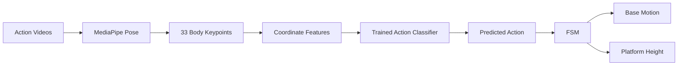

# TurtleBot3 Human-Following Robot

> **YOLO · MediaPipe · Finite State Machine · ROS 2**


https://github.com/user-attachments/assets/6a32c3fb-03b1-4017-95bf-57bd3f3b3c3a


  


> **TurtleBot3 + ROS 2 Humble + MediaPipe Pose + Keypoint-Based Action Classification + FSM**

BuddyBot is a service robot system that understands a user's body action from camera input and turns that action into robot behaviour.

Instead of classifying raw RGB frames directly, BuddyBot uses a structured pipeline:

**video -> MediaPipe pose keypoints -> coordinate features -> trained action classifier -> FSM -> robot action**

This makes the system lightweight, explainable, and suitable for real-time interaction.

---

## 1. Project Goal

The goal of BuddyBot is not only to detect a person, but to understand the user's interaction state and respond appropriately.

Example behaviours:

- wave -> start or stop service
- walk -> follow the user
- sit -> move closer and lower the platform
- reach out -> approach for closer interaction
- stand up again -> return to a more normal distance

So the core idea is:

> **Use human action understanding to guide service behaviour.**

---

## 2. System Overview

BuddyBot can be described in four layers:

1. **Data Layer**  
   Record and label user action videos.

2. **Perception Layer**  
   Use MediaPipe Pose to extract 33 body keypoints.

3. **Understanding Layer**  
   Convert keypoints into features and classify the current action.

4. **Behaviour Layer**  
   Use an FSM to map actions to follow, approach, retreat, and platform-height control.

---

## 3. End-to-End Pipeline



### Runtime View

```mermaid
flowchart TD
    CAM[Camera Stream] --> POSE[MediaPipe Pose]
    POSE --> FEAT[Feature Vector]
    FEAT --> CLS[Action Classifier]
    CLS --> ACT[/human_action]
    ACT --> FSM[FSM Controller]
    FSM --> CMD[/cmd_vel]
    ACT --> PLATFORM[Height Controller]
    PLATFORM --> TRAJ[/gix_controller/joint_trajectory]
```

---

## 4. Why Keypoint-Based Learning

BuddyBot does not train directly on raw images because raw frames contain too much irrelevant information:

- background
- clothing
- lighting
- camera noise

Instead, the system first extracts body pose and then learns from pose structure.

Advantages:

- lower-dimensional input
- faster training and inference
- better focus on posture and motion
- easier deployment on a robot

In this project, MediaPipe is the **pose front-end**, and the classifier is the **action understanding back-end**.

---

## 5. Training Pipeline

### Step 1: Collect Action Videos

Record videos for service-related actions such as:

- `Wave`
- `Reach Out`
- `Sitting`
- `Standing`
- `Walk`

### Step 2: Extract Pose Keypoints

Each video is processed frame by frame with MediaPipe Pose.

For each valid frame:

- detect 33 body landmarks
- read landmark coordinates
- flatten them into a numerical vector
- pair the vector with the action label

### Step 3: Build the Dataset

The pose-based samples are stored in files such as:

- `pose_data.csv`
- `motion_dataset.npz`

### Step 4: Train the Action Model

The model learns to map keypoint feature vectors to action labels.

Input:

- 33 keypoints
- `(x, y)` per keypoint
- 66-D feature vector

Output:

- action class probabilities

The trained weights are saved as:

- `pose_model.pth`

---

## 6. Runtime Inference

During live operation, the robot repeats this loop:

1. capture a camera frame
2. run MediaPipe Pose
3. build the same keypoint feature vector used in training
4. feed the vector into the trained model
5. get the predicted action
6. publish the action to the behaviour layer

In short:

```text
camera -> pose keypoints -> feature vector -> trained model -> action label
```

---

## 7. Decision Layer: FSM

Action recognition tells the robot what the user is doing.  
The FSM tells the robot what it should do next.

Main states:

- `IDLE`
- `FOLLOW`
- `APPROACH_60`
- `APPROACH_30`
- `APPROACH_20`
- `RETREAT_60`

Typical logic:

- first `Wave` -> start service
- second `Wave` -> stop service
- `Standing` -> keep standard service distance
- `Sitting` -> move closer and lower platform
- `Reach Out` while sitting -> move to the closest interaction distance
- stand after sitting -> retreat and restore height

This keeps the robot behaviour stable and explainable.

---

## 8. Robot Execution

After the FSM selects a state, BuddyBot executes behaviour in two ways:

### Mobile Base

The base is controlled through `/cmd_vel` to:

- follow
- approach
- retreat
- stop

### Height-Adjustable Platform

The platform is controlled through `/gix_controller/joint_trajectory` to:

- lower for seated interaction
- raise for standing or walking interaction

This is what makes BuddyBot a service robot rather than only a tracking robot.

---

## 9. Typical Interaction Story

1. The user appears in front of the robot.
2. The camera captures the user's motion.
3. MediaPipe extracts body keypoints.
4. The trained model predicts `Wave`.
5. The FSM starts service and the robot enters `FOLLOW`.
6. The user sits down.
7. The model predicts `Sitting`.
8. The robot moves closer and lowers the platform.
9. The user reaches out.
10. The model predicts `Reach Out`.
11. The robot approaches even closer.
12. The user stands up.
13. The robot restores normal distance and platform height.
14. The user waves again.
15. The FSM ends service and the robot returns to `IDLE`.

This is the main story of the project:

> The robot reacts not only to where the user is, but to what the user is doing.

---

## 10. ROS 2 View

Core topics:

| Topic | Meaning |
|---|---|
| `/image_raw/compressed` | camera input |
| `/human_action` | predicted action label |
| `/cmd_vel` | mobile base command |
| `/gix_controller/joint_trajectory` | platform height command |

ROS 2 is used to connect perception, decision, and execution into one robotic system.

---

## 11. Key Assets

- `pose_model.pth` -> trained action model
- `pose_data.csv`, `motion_dataset.npz` -> pose-based dataset
- `assets/design.png`, `assets/FSM.png` -> design illustrations

The repository contains both the learning pipeline and the deployed robot pipeline.

---

## 12. Installation

Requirements:

- Ubuntu 22.04
- ROS 2 Humble
- Python 3.10+
- TurtleBot3 or similar base
- camera input

Install Python dependencies:

```bash
pip install ultralytics mediapipe opencv-python numpy torch torchvision
```

Build:

```bash
colcon build --packages-select buddybot
source install/setup.bash
```

---

## 13. Running

Launch the ROS 2 system:

```bash
ros2 launch buddybot launch.launch.py
```

Run the learned action pipeline:

```bash
python3 buddybot/model_gesture.py
```

Manual testing:

```bash
ros2 run buddybot manual
```

---

## 14. Why This Design

This design separates the project into two clear questions:

1. **What is the user doing?**  
   Answered by MediaPipe + the trained action classifier.

2. **What should the robot do next?**  
   Answered by the FSM.

That separation makes the system:

- easier to explain
- easier to debug
- easier to extend

---

## 15. Limitations

- limited action vocabulary
- dependence on pose quality
- weaker performance under occlusion or extreme viewpoints
- limited temporal modelling
- not primarily designed for multi-person interaction

---

## 16. Summary

BuddyBot is a service-oriented human-robot interaction system that turns body action into service behaviour through a structured learned pipeline:

**video -> pose keypoints -> feature vector -> trained classifier -> FSM -> robot control**

Its main contribution is combining:

- pose-based action understanding,
- learned classification,
- explainable decision logic,
- and physically adaptive robot service behaviour

in one ROS 2 system.
